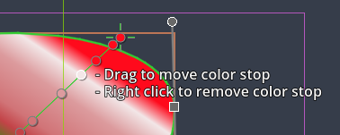
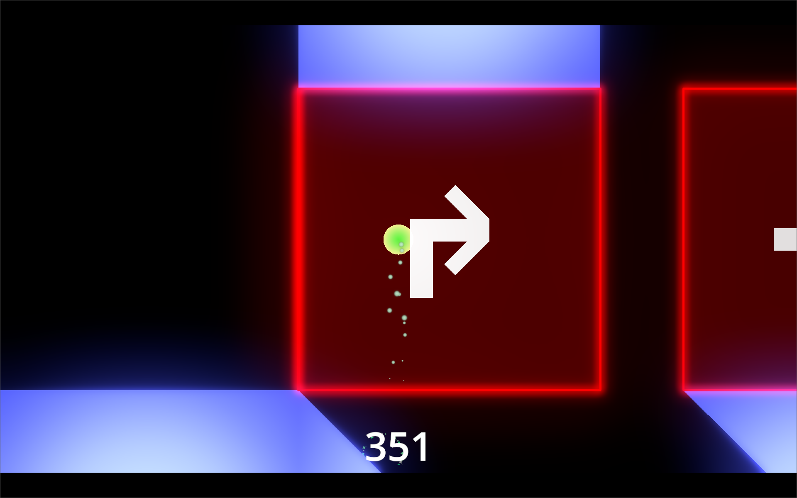

# Scalable Vector Shapes 2D plugin for Godot 4.4

Scalable Vector Shapes 2D lets you do 3 things:
1. Draw seamless vector shapes using a Path Editor inspired by the awesome [Inkscape](https://inkscape.org/) with a new node type: [`ScalableVectorShape2D`](./scalable_vector_shape_2d.gd)[^1]
2. Animate the shape of the curve using keyframes on a [property-track](https://docs.godotengine.org/en/stable/tutorials/animation/introduction.html#doc-introduction-animation)  in an [`AnimationPlayer`](https://docs.godotengine.org/en/stable/classes/class_animationplayer.html#class-animationplayer)
3. Import [.svg](https://www.w3.org/TR/SVG/) files as seamless vector shapes in stead of as raster images[^2]

[^2]: __Important sidenote__: _This plugin only supports a small - yet relevant - subset of the huge [SVG Specification](https://www.w3.org/TR/SVG/struct.html)_

## Watch the A-Z explainer on Youtube

In this 10 minute video I explain how to use all the features of Scalable Vector Shapes 2D in short succession:

[^1]: Looking for EZ Curved Lines 2D? The renamed plugin deprecates the old [`DrawablePath2D`](./drawable_path_2d.gd) custom node in favor of `ScalableVectorShape2D`. A Conversion button is provided: [converter button](./screenshots/00-converter.png). The reason is that [`ScalableVectorShape2D`](./scalable_vector_shape_2d.gd) inherits directly from `Node2D` giving much more control to the plugin over how you can draw.

# Table of Contents

- [Scalable Vector Shapes 2D plugin for Godot 4.4](#scalable-vector-shapes-2d-plugin-for-godot-44)
  - [Watch the A-Z explainer on Youtube](#watch-the-a-z-explainer-on-youtube)
- [Table of Contents](#table-of-contents)
- [Drawing Shapes in the Godot 2D Viewport](#drawing-shapes-in-the-godot-2d-viewport)
  - [Basic Drawing Explainer on youtube](#basic-drawing-explainer-on-youtube)
  - [Quick Start](#quick-start)
- [The Create Shapes Dock](#the-create-shapes-dock)
  - [Creating Paths based on Bézier curves](#creating-paths-based-on-bézier-curves)
  - [Creating 'primitive' shapes: Rectangle and Ellipse](#creating-primitive-shapes-rectangle-and-ellipse)
  - [Draw Settings](#draw-settings)
  - [Futher reading](#futher-reading)
- [The Import SVG File Dock](#the-import-svg-file-dock)
  - [Watch an explainer on Youtube](#watch-an-explainer-on-youtube)
  - [Using the Import SVG File Dock](#using-the-import-svg-file-dock)
  - [`Line2D` Stroke versus `Polygon2D` Stroke](#line2d-stroke-versus-polygon2d-stroke)
  - [The import log](#the-import-log)
- [The Project Settings Dock](#the-project-settings-dock)
  - [Editor Settings (how the 2D Viewport should behave):](#editor-settings-how-the-2d-viewport-should-behave)
  - [Curve Settings](#curve-settings)
- [The Advanced Tab](#the-advanced-tab)
  - [Basic export options](#basic-export-options)
  - [Bake Animations](#bake-animations)
- [Moving, Rotating and Resizing the Points of a Shape](#moving-rotating-and-resizing-the-points-of-a-shape)
  - [Moving (Translating) all the points](#moving-translating-all-the-points)
    - [Translating Ellipses and Rectangles](#translating-ellipses-and-rectangles)
    - [Translating Paths](#translating-paths)
  - [Rotating all the Points](#rotating-all-the-points)
    - [Rotating Ellipses and Rectangles](#rotating-ellipses-and-rectangles)
    - [Rotating Paths](#rotating-paths)
  - [Resizing all the Points](#resizing-all-the-points)
    - [Resizing Ellipses and Rectangles](#resizing-ellipses-and-rectangles)
    - [Resizing Paths](#resizing-paths)
- [Manipulating shapes](#manipulating-shapes)
  - [Adding a point to a shape](#adding-a-point-to-a-shape)
  - [Bending a curve](#bending-a-curve)
  - [Creating, mirroring and dragging control point handles](#creating-mirroring-and-dragging-control-point-handles)
  - [Closing the loop and breaking the loop](#closing-the-loop-and-breaking-the-loop)
  - [Deleting points and control points](#deleting-points-and-control-points)
  - [Setting the global position of a point / curve handle manually](#setting-the-global-position-of-a-point--curve-handle-manually)
  - [Create a cutout/clip/merge shape (a hole, a clipped frame, ...)](#create-a-cutoutclipmerge-shape-a-hole-a-clipped-frame-)
    - [Cutting out an empty shape](#cutting-out-an-empty-shape)
  - [Converting a line segment into an arc-segment](#converting-a-line-segment-into-an-arc-segment)
  - [Editing arc properties](#editing-arc-properties)
  - [Setting the pivot of your shape](#setting-the-pivot-of-your-shape)
- [Manipulating 2D Shapes in the 3D export](#manipulating-2d-shapes-in-the-3d-export)
  - [Animating 3D curves](#animating-3d-curves)
- [Manipulating gradients](#manipulating-gradients)
  - [Changing the start- and endpoint of the gradient](#changing-the-start--and-endpoint-of-the-gradient)
  - [Changing the color stop positions](#changing-the-color-stop-positions)
  - [Add new color stops](#add-new-color-stops)
  - [Ways to prevent 'over-selecting' `ScalableVectorShape2D` nodes](#ways-to-prevent-over-selecting-scalablevectorshape2d-nodes)
- [Using the Inspector Form for `ScalableVectorShape2D`](#using-the-inspector-form-for-scalablevectorshape2d)
  - [Inspector Form](#inspector-form)
    - [Convert to Path button](#convert-to-path-button)
  - [The Fill inspector form](#the-fill-inspector-form)
  - [The Stroke inspector form](#the-stroke-inspector-form)
    - [Creating new Strokes](#creating-new-strokes)
  - [The Collision inspector form](#the-collision-inspector-form)
  - [The Navigation inspector form](#the-navigation-inspector-form)
  - [The Curve settings inspector form](#the-curve-settings-inspector-form)
  - [The Masking Inspector form](#the-masking-inspector-form)
  - [The Shape type inspector form](#the-shape-type-inspector-form)
  - [The Editor settings inspector form](#the-editor-settings-inspector-form)
  - [The Export Options inspector form](#the-export-options-inspector-form)
    - [Export as PNG button](#export-as-png-button)
    - [Export as 'baked' scene button](#export-as-baked-scene-button)
      - [Caveats when 'Baking'](#caveats-when-baking)
- [More about assigned `Line2D`, `Polygon2D` and `CollisionObject2D`](#more-about-assigned-line2d-polygon2d-and-collisionobject2d)
  - [Watch the chapter about working with collisions, paint order and the node hierarchy on youtube](#watch-the-chapter-about-working-with-collisions-paint-order-and-the-node-hierarchy-on-youtube)
- [Animating / Changing shapes at runtime](#animating--changing-shapes-at-runtime)
  - [Youtube explainer on animating](#youtube-explainer-on-animating)
  - [A note up front (this being said)](#a-note-up-front-this-being-said)
  - [Animating the shape and gradients at Runtime](#animating-the-shape-and-gradients-at-runtime)
  - [Add keyframes in an animation player](#add-keyframes-in-an-animation-player)
  - [Don't duplicate `ScalableVectorShape2D`, use the `path_changed` signal in stead](#dont-duplicate-scalablevectorshape2d-use-the-path_changed-signal-in-stead)
  - [Performance impact](#performance-impact)
- [Autoscaling SVG Textures for GUI Controls](#autoscaling-svg-textures-for-gui-controls)
  - [Adding Autoscaling SVG Textures via the Inspector](#adding-autoscaling-svg-textures-via-the-inspector)
    - [Example of Autoscaling GUI](#example-of-autoscaling-gui)
  - [Removing an Automatically Scaled Texture](#removing-an-automatically-scaled-texture)
  - [Advanced use of `SVGTextureHelper`](#advanced-use-of-svgtexturehelper)
- [FAQ's](#faqs)
  - [The curve of my `ScalableVectorShape2D` won't animate at runtime, what do I do?](#the-curve-of-my-scalablevectorshape2d-wont-animate-at-runtime-what-do-i-do)
  - [I want to change shapes while debugging my game. Is this even possible?](#i-want-to-change-shapes-while-debugging-my-game-is-this-even-possible)
  - [When I animate the curve of an imported scene, it animates all the other curves as well](#when-i-animate-the-curve-of-an-imported-scene-it-animates-all-the-other-curves-as-well)
  - [When I duplicate a `ScalableVectorShape2D` and change its shape, the original `ScalableVectorShape2D` shape also changes](#when-i-duplicate-a-scalablevectorshape2d-and-change-its-shape-the-original-scalablevectorshape2d-shape-also-changes)
  - [Can I draw shapes programmatically?](#can-i-draw-shapes-programmatically)
  - [Should I draw shapes programmatically?](#should-i-draw-shapes-programmatically)
  - [When should I draw shapes programmatically?](#when-should-i-draw-shapes-programmatically)
  - [Can I change shapes in the 2D editor while running the game?](#can-i-change-shapes-in-the-2d-editor-while-running-the-game)
- [Attributions](#attributions)
  - [Lots of thanks go out to those who helped me out getting started:](#lots-of-thanks-go-out-to-those-who-helped-me-out-getting-started)
  - [And a big thank you goes to to @MewPurPur](#and-a-big-thank-you-goes-to-to-mewpurpur)
  - [Many thanks to @HannesParth/Permotion](#many-thanks-to-hannesparthpermotion)
  - [And of course everyone who helped test and review the code thus far](#and-of-course-everyone-who-helped-test-and-review-the-code-thus-far)
- [Reaching out / Contributing](#reaching-out--contributing)

# Drawing Shapes in the Godot 2D Viewport

## Basic Drawing Explainer on youtube

## Quick Start
After activating this plugin a new bottom panel item appears, called "Scalable Vector Shapes 2D".

There are 2 recommended ways to start drawing:
1. [Creating a Circle/Ellipse, Rectangle or empty Path using the bottom panel item](#the-create-shapes-dock)
2. [Using the `.svg` importer](#using-the-import-svg-file-dock)

# The Create Shapes Dock

The  `Create Shapes` tab gives you some basic choices:

## Creating Paths based on Bézier curves

Pressing the `Create Empty Path` or one of the `Create Path` buttons will add a new shape to an open `2D Scene` in 'Path' mode, meaning all points in the 'Bézier' curve are editable.

## Creating 'primitive' shapes: Rectangle and Ellipse

It's probably easier to start out with a basic primitive shape (like you would in Inkscape <3) using the `Create Rectangle` or `Create Ellipse` button. This will expose less features, but will make it a lot easier to manipulate shapes:

Ellipses will only have one handle to change the `size` property with (representing the x and y diameter). This will set the `rx` and `ry` property indirectly.

Rectangles will have a handle for `size` and 2 handles for rounded corners `rx` and `ry` property.

## Draw Settings

- Enable/Disable Fill (when creating new shapes via this bottom panel)
- Fill color (when creating new shapes in this bottom panel)
- Enable/Disable Stroke (when creating new shapes this this bottom panel)
- Stroke color (when creating new shapes in this bottom panel)
- Choose a `CollisionObject2D` type (when creating new shapes in this bottom panel, default is no collision object assignment)
- Paint order: a toggle which represent what comes in front of what (when creating new shapes in the bottom panel)
- Stroke Settings:
- Stroke Width (when creating new shapes via this bottom panel)
- Use `Line2D`: when flagged off, a `Polygon2D` will be used to draw strokes with in stead (see also: [`Line2D Stroke` versus `Polygon2D Stroke`](#line2d-stroke-versus-polygon2d-stroke) )
- Begin- and End Cap modes
- Line Joint Mode

## Futher reading
Read more about [manipulating shapes](#manipulating-shapes)

# The Import SVG File Dock

## Watch an explainer on Youtube

## Using the Import SVG File Dock

On the left side of this panel is a form with a couple of options:

- Import as ScalableVectorShape2D: check this Off if you want to import the svg file with only built-in godot nodes, without being able to edit/animate the curves in the editor.
- Lock imported shapes in editor: this simply flags on the lock so that the `Polygon2D`, `Line2D`, etc are not selected on click, but the owning ScalableVectorShape2D is
- Flag on antialiased on Polygon2D and Line2D: flags on the `antialiased` property of either
- Use Line2D for Strokes: when flagged Off a `Polygon2D` is used for strokes in stead of a Line2D
- Pick a `CollisionObject2D` type to also generate collision polygons when importing the svg file

## `Line2D` Stroke versus `Polygon2D` Stroke

A tooltip highlights the costs and benefits when picking either of these to draw strokes with:
- A `Polygon2D` stroke can be more neatly clipped than a `Line2D`
- `CollisionPolygon2D`'s match `Polygon2D` Stroke better
- A `Polygon2D` stroke can be textured with gradients like fills are textured
- `Line2D` has sharper caps and line joints at high zoom
- `Line2D` can be textured directionally in stead of like a Fill texture
- `Line2D` can set different Begin and End Cap Modes where `Polygon2D` can only pick one

## The import log

On the right side is an import log, which will show warnings of known problems, usually unsupported stuff.

The link it shows is to the issues list on the github repository hosting this plugin. Here you can report any encountered bugs while importing SVG files using this plugin.

# The Project Settings Dock

## Editor Settings (how the 2D Viewport should behave):

- Enable/Disable ScalableVectorShape2D Editing (when checked off, you can edit nodes the normal, built-in, godot-way. You _are_ going to need this)
- Show/Hide Edit hints
- Show Point Details (which are the exact _indices_ of each point on the `Curve2D` of this shape, what is it's global position)
- Snap to Pixel (snaps points and curve handles to whole pixels on the global transform)
- Snap distance (the snap step / resolution)

## Curve Settings

These settings are applied to the `Curve Settings` of new shapes when added via the bottom panel docks (either SVG importer or via Create Shapes).

For more information on these settings, please refer to the section on [The Curve settings inspector form](#the-curve-settings-inspector-form)

# The Advanced Tab

Since release `2.13.0` a tab named 'Advanced' is added to the bottom dock.

## Basic export options
- PNG file (see [Export as PNG Button](#export-as-png-button) )
- A 'Baked' scene (see [Export as 'baked' scene button](#export-as-baked-scene-button))
- 3D scene: creates a new 3D scene, in which all the Fills and Strokes in the scene are turned into instances of `CSGPolygon3D`[^6]

[^6]: Coming soon: a 3D Node with an editable outline using a `ScalableVectorShape2D` node

## Bake Animations
Since `2.14.0` you can export your animated scene as sprite frames in one PNG spritesheet or separate PNG files.

# Moving, Rotating and Resizing the Points of a Shape

Release `2.16.0` adds the posibility to do uniform transforms on the points of a shape, as opposed to the entire node.

When a `ScalableVectorShape2D` is selected in `Select Mode (Q)`, the following command buttons are made available:

- `Move all the Points without moving the Node (Z)`
- `Rotate all the Points without rotating the Node (X)`
- `Resize all the Points without scaling the Node (C)`
- `Edit the points normally (Q)`

## Moving (Translating) all the points

When moving all the points of a shape, the `Node2D.position` property does not change.

This operation responds to the snap-to-pixel mode of the `Project Settings` tab.

### Translating Ellipses and Rectangles

In the case of the 2 supported primitive shapes, the `offset` property is changed, to represent the translation.

The `offset` property can be used to set keyframes in an `AnimationPlayer` and is so easier to use than the `Batch Update` button for an entire curve.

### Translating Paths

When the `Shape Type Settings > Shape Type` is `Path`, all the points are simply moved, relative to the node position (translating their individual local position).

## Rotating all the Points

When rotating all the points of a shape, the `Node2D.rotation` property does not change.

Just like rotating `Node2D`, holding `Ctrl` allows you to rotate in steps of 5°.

### Rotating Ellipses and Rectangles

In the case of the 2 supported primitive shapes, the `spin` property is changed, to represent the rotation of all the points.

The `spin` property can be used to set keyframes in an `AnimationPlayer` and is so easier to use than the `Batch Update` button for an entire cruve.

### Rotating Paths

When the `Shape Type Settings > Shape Type` is `Path`, all the points can be rotated in 2 ways:
1. Around the `Node2D`'s pivot
2. Around their natural center (by holding the `Shift` button - this is not perfect, but comes close enough)

## Resizing all the Points

When resizing all the points of a shape, the `Node2D.scale` property does not change, this is especially useful when using strokes, because their width will remain the same this way.

This operation responds to the snap-to-pixel mode of the `Project Settings` tab.

### Resizing Ellipses and Rectangles

In the case of the 2 supported primitive shapes, the `size` property is changed, to represent the 'distance' of all the points away from their origin.

The `size` property can be used to set keyframes in an `AnimationPlayer` and is so easier to use than the `Batch Update` button for an entire cruve.

### Resizing Paths

When the `Shape Type Settings > Shape Type` is `Path`, all the points can be resized in 2 ways:
1. Away from / towards the `Node2D`'s pivot
2. Away from / towards their natural center (by holding Shift)

# Manipulating shapes

The hints in the 2D viewport should have you covered, but this section lists all the operations available to you. You can also watch the chapter on sculpting paths on youtube:

## Adding a point to a shape

Using `Ctrl`[^5] + `Left Click` you can add a point anywhere in the 2D viewport, while your shape is selected.

[^5]: Use `Cmd` in stead of `Ctrl` on a mac

By double clicking on a line segment you can add a point _inbetween_ 2 existing points:

## Bending a curve

Holding the mouse over line segment you can start dragging it to turn it into a curve.

## Creating, mirroring and dragging control point handles

When you have new node you can drag out curve manipulation control points while holding the `Shift` button. The 2 control points will be mirrored for a symmetrical / round effect.

Dragging control point handles while holding `Shift` will keep them mirrored / round:

Dragging them without holding shift will allow for unmirrored / shap corners:

## Closing the loop and breaking the loop

Double clicking on the start node, or end node of an unclosed shape will close the loop.

Double clicking on the start-/endpoint again will break the loop back up:

You can recognise the start-/endpoint(s) by the infinity symbol: ∞

## Deleting points and control points

You can delete points and control points by using right click.

## Setting the global position of a point / curve handle manually

Using `Alt+Click` you can now open a form to set the global position of a point manually:

## Create a cutout/clip/merge shape (a hole, a clipped frame, ...)

While holding `Ctrl+Shift`[^5] on a selected shape you can start adding cutouts to your selected shape:
- Use `mousewheel` to change shapes (rectangle, ellipse, or empty path)
- Use `right click` to change operation (cut out, clip, or merge)
- Use `left click` __on__ your selected shape to create _and_ select the new `ScalableVectorShape2D` which acta as a cutout, a frame clipping, or merged shape:

### Cutting out an empty shape

When cutting out an empty shapem, the created cutout will have only _one_ point, so to see the effect you'd need to add more points to using regular `Ctrl+Click`[^5]:

## Converting a line segment into an arc-segment

Use `Right click` on a line segment to convert it into an arc[^3] (a an ellipse-shaped bend with an x- and y-radius).

Use `Right click` on an arc again to convert it back into a normal line segment.

## Editing arc properties

Using `Left click` on an arc segment opens a popup form to edit the properties of the arc:
- radius (`rx` / `ry`)
- rotation (rotates the arc around its elliptical center; is only noticable when radius is non-uniform)
- large arc (when the arc's radius is greater than distance between its start- and endpoint it can be drawn the short and the long way 'round)
- sweep (determines the direction the arc points are drawn: clockwise / counter-clockwise; this effectively flips the arc)

[^3]: Arcs are implemented the same way as specified by the [w3c for scalable vecor graphics](https://www.w3.org/TR/SVG/paths.html#PathDataEllipticalArcCommands).

## Setting the pivot of your shape

You can use the `Change pivot` mode to change the origin of your shape, just like you would a `Sprite2D`. In this case, the 'pivot' will actually be the `position` property of you `ScalableVectorShape2D` node.

This rat will want to rotate it's head elsewhere:

Like this:

# Manipulating 2D Shapes in the 3D export

Using the new `Export to 3D Scene` in the [Advanced Editing Tab](#the-advanced-tab) produces the new `AdaptableVectorShape3D` node, which holds instances of `CSGPolygon3D` with:

Pressing the button `Add 2D Shape Editor` will instantiate a new `ScalableVectorShape2D` that can be used to edit with. For now I will suffice with a screenshot. I'm hope to record a long explainer about this soon.

This screenshot was made using the [DualEditor](https://github.com/Meta-Ben/DualEditor) plugin by @Meta-Ben, which is _very_ useful for this purpose:

## Animating 3D curves

You can also use the `Batch insert` button for curve key frames to animate the 3D shape's curve. Of course the [performace impact](#performance-impact) for this is not negligable.

# Manipulating gradients

Once a gradient is assigned to the 'Fill' of your shape via the inspector, its properties can be changed using the same controls as will the other handles.

## Changing the start- and endpoint of the gradient

Drag the outer orbit of the start- and endpoint of a the gradient line using the left mouse button to move them:

## Changing the color stop positions

Drag the color stops along the gradient line to change their position.

Right click to remove a color stop.

## Add new color stops

Double clicking on the gradient line will add a new color stop (the assigned color will be sampled from the existing color at that point)

## Ways to prevent 'over-selecting' `ScalableVectorShape2D` nodes

This plugin can sometimes get in the way of the default 2D viewport behavior. Sometimes it is hard _not_ to select a `ScalableVectorShape2D`.

There are 4 ways to get around this:
1. Locking the `ScalableVectorShape2D` using the lock toggle  button above the 2D viewport
2. Hiding the `ScalableVectorShape2D` via the scene tree
3. Saving the branch containing the `ScalableVectorShape2D` as a new scene via the scene tree and importing it will also prevent selection
4. Toggling off Enable/Disable ScalableVectorShape2D Editing altogether in the bottom panel

# Using the Inspector Form for `ScalableVectorShape2D`

The following custom forms were added, with extensive tooltips to help explain the actual functions they provide:

- [Fill](#the-fill-inspector-form) (actually the assigned `Polygon2D`)
- [Stroke](#the-stroke-inspector-form) (actually the assigned `Line2D` or `Polygon2D`)
- [Collision](#the-collision-inspector-form) (manages an assigned `CollisionObject2D`)
- [Navigation](#the-navigation-inspector-form) (manages an assigned `NavigationRegion2D`)
- [Curve Settings](#the-curve-settings-inspector-form)
- [Masking](#the-masking-inspector-form)
- [Shape Type Settings](#the-shape-type-inspector-form)
- [Editor Settings](#the-editor-settings-inspector-form)
- [Export Options](#the-export-options-inspector-form)

## Inspector Form

### Convert to Path button

When a primitive shape (basic rectangle or ellipse) is selected, a `Convert to Path`-button is available at the top of the inspector.

## The Fill inspector form

When the selected shape has no fill, an `Add Fill` button is provided. Clicking that will create and assign a new `Polygon2D` to the selected `ScalableVectorShape2D`:

Once assigned, the following options are available:
- Fill color, changes the `color` property of the assigned `Polygon2D`
- Gradient, will assign or remove a `GradientTexture2D` to the `Polygon2D`
- Stop colors (if a gradient is set), one color button per color
- A `Edit Polygon2D` button, which will make the editor select the assigned `Polygon2D`

Below that, a standard godot `Assign ...`-field is also available to set the `polygon`-property directly with and to enable unassignment.

## The Stroke inspector form

With this form the following `ScalableVectorShape2D` properties can be edited:
- `stroke_color`
- `stroke_width`
- `begin_cap_mode` (in case of a `Polygon2D`-based stroke, this will also set the end cap)
- `end_cap_mode`
- `line_joint_mode`

When a `Line2D` is assigned to draw the stroke with, these properties will be kept synchronized with the `ScalableVectorShape2D` properties.

In case of a `Polygon2D` based stroke, the `stroke_color` will be kept synchronized with the `Polygon2D` color.

### Creating new Strokes
When the selected shape has no stroke, an extra set of buttons is provided:
- `Add Line2D Stroke`
- `Add Polygon2D Stroke`

Clicking either will create and assign a new `Line2D` or `Polygon2D` to the selected `ScalableVectorShape2D`:

Below that, a standard godot `Assign ...`-field is also available to set these properties:
- `line`: a `Line2D` assignment
- `poly_stroke`: a `Polygon2D` assignment

## The Collision inspector form

This works the same as the Fill- and Stroke forms, but in this case a descendant of a `CollisionObject2D` is assigned to the `collision_object`-property[^4]:

[^4]: Note that the `collision_polygon` property of `ScalableVectorShape2D` remains supported for backward compatibility, even though the inspector form will now show a deprecation warning and suggest replacing it by assigning a `CollisionObject2D` to the `collision_object` property.

Every time the shape is changed, one or more `Polygon2D` nodes will be added/updated as direct children of this `collision_object`. The descendants of `CollisionObject2D` are:

- `StaticBody2D`
- `Area2D`
- `AnimatableBody2D`
- `RigidBody2D`
- `CharacterBody2D`
- `PhysicalBone2D`

## The Navigation inspector form

This form can hold a reference to an assigned `NavigationRegion2D`. When the shape changes, a new navigation polygon is calculated.

## The Curve settings inspector form

The curve settings inspector form provides the following options
- A `Batch insert` keyframes button for all the `Curve2D`'s control points (the whole shape). This will be active when a valid track is being edited in a `AnimationPlayer` via the bottom panel
- The standard godot built-in editor for `Curve2D` resources, assigned to the `curve` property of the selected `ScalableVectorShape2D`
- The `update_curve_at_runtime` checkbox, which enables animating the entire shape
- The `max_stages` property which influences smoothness (and performance!) of curve drawing; a higher value means smoother lines
- The `tolerance_degrees` property, which also influences smoothness (and performance) of curve drawing: a lower value adds a smoother curve, especially for very subtle bends
- The `arc_list` property: a container for the metadata-objects describing elliptical arc segments of the curve (implemented via `ScalableArc2D` and `ScalableArcList` resource-classes).

## The Masking Inspector form

These properties are used for clipping this shape and cutting out of this shape.

- The `clip_paths` property: an array of assigned `ScalableVectorShape2D`-nodes, which describe the shapes to cut out of this shape
- When the `use_interect_when_clipping` property is checked on and this `ScalableVectorShape2D` is used in another's clip_paths array, the `Geometry2D.intersect_polygons(...)` operation is used in stead of the `Geometry2D.clip_polygons(...) operation`
- When the `use_union_in_stead_of_clipping` property is check on and this `ScalableVectorShape2D` is used in another's clip_paths array, the `Geometry2D.merge_polygons(...)` operation is used in stead of the `Geometry2D.clip_polygons(...) operation`[^8]

[^8]: see also: the [cloud example](./examples/cloud.tscn)

## The Shape type inspector form

This form allows manipulation of the properties of primitive shape types (rectangle, ellipsis):
- Shape type, here you can selected the type of the shape: Path, Rect and Ellipse. (Be warned: changing a shape from a path to a primitive shape is a destructive action and cannot be undone)
- Offset: this represents the position of the pivot relative to the shape's natural center.
- Size: the box size of the entire shape (stroke thickness excluded)
- Rx: the x-radius of the shape
- Ry: the y-radius of the shape

It is best to change these properties via the handles in the 2D editor. They are, however, quite useful for animating key frames.

## The Editor settings inspector form

This form exposes 2 settings:

- Shape Hint Color: the color of the line with which this shape is drawn, when selected
- Lock Assigned Shapes: when this is checked, added strokes, fills and collision polygons will be locked in the editor, once created.

## The Export Options inspector form

### Export as PNG button

With the `Export as PNG`-button you can save any `ScalableVectorShape2D` and its children as a new `.png`-file. Note that nodes which are assigned as Fill or Stroke that are higher up in the hierarchy will be excluded from the exported file.

You _can_ however change the type of any `Node2D` to `ScalableVectorShape2D` temporarily in order to export group of shapes as a PNG file.

### Export as 'baked' scene button

With the `Export as baked scene` button you can generate a new scene (like `Save branch as scene`), with all the `ScalableVectorShape2D`-nodes converted to basic `Node2D`-nodes.

Use this when you are done drawing entirely and do not want to update curves at runtime, or when you want to keep the shapes but drop the dependency of this plugin from your project.

#### Caveats when 'Baking'
An exported AnimationPlayer will not support animated curves, track references will, however, remain.

# More about assigned `Line2D`, `Polygon2D` and `CollisionObject2D`

Using the `Add ...` buttons in the inspector simply adds a new node as a child to `ScalableVectorShape2D` but it does __not need to be__ a child. The important bit is that the new node is _assigned_ to it via its properties: `polygon`, `line` and `collision_object`.

## Watch the chapter about working with collisions, paint order and the node hierarchy on youtube

This video gives more context on how `Line2D`, `Polygon2D` and `CollisionPolygon2D` are _assigned_ to the `ScalableVectorShape2D`:

# Animating / Changing shapes at runtime

## Youtube explainer on animating

Watch this explainer on youtube on animating:

## A note up front (this being said)

The shapes you create will work fine with basic key-frame operations.

You can even detach the Line2D, Polygon2D and CollisionObject2D from `ScalableVectorShape2D` entirely, once you're done drawing and aligning, and change the `ScalableVectorShape2D` to a simple `Node2D` if necessary.

## Animating the shape and gradients at Runtime

Sometimes, however, you want your shape to change at runtime (or even your collision shape!)

You can use the `Update Curve at Runtime` checkbox in the inspector to enable dynamic changing of your curved shapes at runtime.

## Add keyframes in an animation player

You can then add an `AnimationPlayer` node to your scene, create a new animation and (batch) insert key frames for the following:

- The entire shape of your `ScalableVectorShape2D`, which are:
  - `curve:point_*/position`
  - `curve:point_*/in`
  - `curve:point_*/out`
  - `arc_list:arc_*/radius`
  - `arc_list:arc_*/rotation_deg`
  - `arc_list:arc_*/large_arc_flag`
  - `arc_list:arc_*/sweep_flag`
- All the gradient properties of your fill (`Polygon2D` assigned to `ScalableVectorShape2D`), which are:
  - `texture:gradient:colors` (the entire `PackedColorArray`)
  - `texture:gradient:offsets` (the entire `PackedFloat32Array`)
  - `texture:fill_from`
  - `texture:fill_to`
- Fill color, i.e.: the `color` of the assigned `Polygon2D`

__* Note: the keyframes of stroke properties are set directly on `ScalableVectorShape2D` as of release 2.12__

## Don't duplicate `ScalableVectorShape2D`, use the `path_changed` signal in stead

When the `update_curve_at_runtime` property is checked, every time the curve changes in your game the `path_changed` signal is emitted.

Duplicating a `ScalableVectorShape2D` will __not__ make a new `Curve2D`, but use a reference. This means line-segments will be calculated multiple times on one and the same curve! Very wasteful.

If however you want to, for instance, animate 100 blades of grass, just use __one__ `ScalableVectorShape2D` and have the 100 `Line2D` node listen to the `path_changed` signal and overwrite their `points` property with the `PackedVector2Array` argument of your listener `func`:

This very short section of the youtube video illustrates how to do this: https://youtu.be/IwS2Rf65i18?feature=shared&t=55

## Performance impact

Animating curve points at runtime does, however, impact performance of your game, because calculating segments is an expensive operation.

Under `Tesselation settings` you can lower `Max Stages` or bump up `Tolerance Degrees` to reduce curve smoothness and increase performance (and vice-versa)

# Autoscaling SVG Textures for GUI Controls

Release `2.15` makes it easy to add crisp, autoscaling images for your GUI Control nodes using two new classes:

- `SVGTextureHelper`: a `Node` that manages an SVG image resource when it's a direct child of a `TextureRect`, `Button`, or `TextureButton`
- `SVGTextureResource`: a `Resource` that holds a reference to the svg file and a base64 encoded string of the file's contents, as well as a baseline scale factor (so you can even keep the image crips and sharp at higher zoom levels)

## Adding Autoscaling SVG Textures via the Inspector

These 3 control nodes now have an extra button `Set Scalable SVG Texture` in the inspector to set their texture with:

- `TextureRect`
- `Button`
- `TextureButton`

Once an SVG file has been chosen as a texture, a `SVGTextureHelper` node is automatically added to manage the automatically scaled image via a `SVGTextureResource`.

A button with the name of the texture property and an icon-preview will then be presented with which you can pick another SVG file source.

### Example of Autoscaling GUI

There is an example scene in the plugin directory: `addons/curved_lines_2d/examples/gui.tscn`.

## Removing an Automatically Scaled Texture

To remove this type of texture again, the `SVGTextureHelper` node needs to be deleted via the scene tree:

## Advanced use of `SVGTextureHelper`

Any `Control` node's `Texture2D` properties can be managed by a manually added `SVGTextureHelper`. For this you will need to set the `target_property`-field of the `SVGTextureHelper` manually.

# FAQ's

## The curve of my `ScalableVectorShape2D` won't animate at runtime, what do I do?
Check the box:

## I want to change shapes while debugging my game. Is this even possible?

Yes, when you check the box `Update Curve at Runtime` box.

## When I animate the curve of an imported scene, it animates all the other curves as well

This is a common issue: there is _one_ `Curve2D` instance being referenced by all scenes. You fix this by checking On "Local To Scene" for the `Curve2D`:

## When I duplicate a `ScalableVectorShape2D` and change its shape, the original `ScalableVectorShape2D` shape also changes

This is a common issue: there is _one_ `Curve2D` instance being referenced by both nodes.

You can work around this by using 'Make unique' by right-clicking `Curve settings > Curve > Curve2D` in the Inspector of your duplicated shape:

When using [arcs](#editing-arc-properties) in a shape the `Arc List` property must also be 'made unique'

Overriding the default duplication behavior of godot can lead to more unforeseen problems. So [a good solution must be well thought through](https://github.com/Teaching-myself-Godot/ez-curved-lines-2d/issues/200#issuecomment-3318594193).

Search reddit on the trials and tribulations of 'Make Unique':

- https://www.reddit.com/r/godot/search/?q=make+unique

## Can I draw shapes programmatically?

Yes you can. There are a couple of small things to be aware of:
1. You need to set `my_shape.up_date_curve_at_runtime = true`
2. To draw anything, your shape needs a Stroke, Fill, or Collision Object:
  1. Setting a stroke: `my_shape.line = Line2D.new()`
  2. Setting a fill: `my_shape.polygon = Polygon2D.new()`
  3. Setting a collision object: `my_shape.collision_object = StaticBody2D.new()`
3. The Stroke, Fill, Collision Object need to be inside the scene tree, i.e.: `my_shape.add_child(my_shape.line)`

I added a [small example](./examples/add_shapes_programmatically/click_ellipse.gd) based on [this question](https://github.com/Teaching-myself-Godot/ez-curved-lines-2d/issues/111)

## Should I draw shapes programmatically?

This depends on the complexity of what you want to achieve.

In many  cases just drawing something in the editor and saving it as a scene to import elsewhere (or `instantiate()` via preloading) is a better option, adhering to the _Keep it Simple_ principle.

But that's just my personal opinion.

## When should I draw shapes programmatically?

There are very many situations left where you might want to do exactly this, but that is up to your own creativity.

One powerful feature I can think of is 'mining': use `ScalableVectorShape2D`-nodes to make cuts in collision shapes and navigation areas.

Playing [Rat's Return](./examples/rat/rats_return.tscn) will give a first impression how this might work:

`ScalableVectorShape2D` already ships quite some convenience methods like:
- `clipped_polygon_has_point(global_pos : Vector2) -> bool` and
- `add_clip_path(other_shape : ScalableVectorShape2D)`

But I have not come around to documenting yet.

## Can I change shapes in the 2D editor while running the game?

When the `Update Curve At Runtime` checkbox is checked, the shape will also sync up with a scene running in debug mode.

Once you're done drawing and do not need the shape to change anymore at runtime you can turn this checkbox off again.

# Attributions

## Lots of thanks go out to those who helped me out getting started:
- This plugin was first inspired by [Mark Hedberg's blog on rendering curves in Godot](https://www.hedberggames.com/blog/rendering-curves-in-godot).
- The suggestion to support both `Polygon2D` and collisions was done by [GeminiSquishGames](https://github.com/GeminiSquishGames), who's pointers inspired me to go further, like implementing uniform transform tools.
- The SVG Importer code was adapted from the script hosted on github in the [pixelriot/SVG2Godot](https://github.com/pixelriot/SVG2Godot) repository
- The code for making cutout shapes was adapted from the great [knife tool plugin](https://github.com/mrkdji/knife-tool/) by @mrkdji
- The inspiration for using [Geometry2D.offset_polyline](https://docs.godotengine.org/en/stable/classes/class_geometry2d.html#class-geometry2d-method-offset-polyline) for strokes came from @theshaggydev, who recorded [this video](https://www.youtube.com/watch?v=5TW7H7aXhxQ) about it.
- Lot's of gratitude to [@kcfresh53](https://github.com/kcfresh) for architecting the auto-scaling control image textures via the `SVGTextureHelper` node and the `SVGTextureResource`

## And a big thank you goes to to [@MewPurPur](https://github.com/MewPurPur)

The author of GodSVG for writing a great [SVG Arc command implementation](https://github.com/MewPurPur/GodSVG/blob/v1.0-alpha10/src/data_classes/ElementPath.gd#L117) I could reuse here:
- Download from the [GodSVG website](https://www.godsvg.com/)
- Or try out the [web version](https://www.godsvg.com/editor/)
- Also on [itch.io](https://mewpurpur.itch.io/godsvg)

## Many thanks to @HannesParth/Permotion

As an early adopter Hannes was quick to point out good quality of life improvements like snap to pixel, setting global position exactly and exporting as PNG.

Make sure to try out ["Spring Ball" on Itch](https://permotion.itch.io/spring-ball), a 48h game jam solo project that used ScalableVectorShape2D for all level objects, including a wrapper script to change the block that makes up the majority of the level between cube and triangle shapes:

## And of course everyone who helped test and review the code thus far

- @hedberg-games
- @thiagola92
- @HannesParth

# Reaching out / Contributing
If you have feedback on this project, feel free to post an [issue](https://github.com/Teaching-myself-Godot/ez-curved-lines-2d/issues) on github, or to:
- Ask a question on [reddit](https://www.reddit.com/r/ScalableVectorShape2D)
- Follow my channel on youtube: [@zucht2.bsky.social](https://www.youtube.com/@zucht2.bsky.social)
- Contact me on bluesky: [@zucht2.bsky.social](https://bsky.app/profile/zucht2.bsky.social).
- Try my free to play games on itch.io: [@renevanderark.itch.io](https://renevanderark.itch.io)

If you'd like to improve on the code yourself, ideally use a fork and make a pull request.

This stuff makes me zero money, so you can always branch off in your own direction if you're in a hurry.
